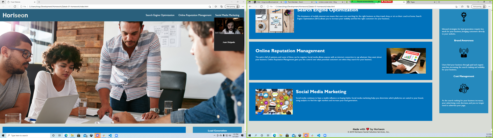

# <Zaleski-01-Homework>
## Description
Provide a short description explaining the what, why, and how of your project. Use the following questions as a guide:
- The motivation behind this project was to refract the existing code to be more readable and consolidate redundancies.
- This project was done to help hone my skills in my first week's activities, and show me which ones I need to work on.
- Access of readability is important, almost everything can be considered a div, but its better to use element tags, like section, article, body, header, etc.
- This project taught me patience in dealing with other's code, as well as how to better organize my own personal code.

## Usage
For this project, we were given a simple webpage and told to make it fit the acceptance criteria:
-GIVEN a webpage meets accessibility standards
-WHEN I view the source code
-THEN I find semantic HTML elements
-WHEN I view the structure of the HTML elements
-THEN I find that the elements follow a logical structure independent of styling and positioning
-WHEN I view the image elements
-THEN I find accessible alt attributes
-WHEN I view the heading attributes
-THEN they fall in sequential order
-WHEN I view the title element
-THEN I find a concise, descriptive title

https://kingcrowz.github.io/Zaleski-01-homework/

 